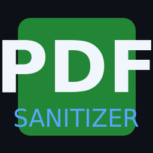

# PDF Forensic Sanitizer

<p align="center">
  
</p>

<p align="center">
  <strong>Remove metadata and forensic traces from PDF files</strong>
</p>

<p align="center">
  <a href="https://github.com/ItayNaftali/PDF_Sanatizer/releases/latest">
    
  </a>
</p>

<p align="center">
  Created by <strong>Itay Naftali</strong>
</p>

---

## Downloads

| Platform | Download Link |
|----------|---------------|
| **Windows** | [⬇️ Download for Windows](https://github.com/ItayNaftali/PDF_Sanatizer/releases/latest/download/PDF_Forensic_Sanitizer_Windows.zip) |
| **macOS** | [⬇️ Download for Mac](https://github.com/ItayNaftali/PDF_Sanatizer/releases/latest/download/PDF_Forensic_Sanitizer_Mac.zip) |
| **Linux** | [⬇️ Download for Linux](https://github.com/ItayNaftali/PDF_Sanatizer/releases/latest/download/PDF_Forensic_Sanitizer_Linux.zip) |

> All downloads are automatically built and released from the latest code.

---

## What This Tool Removes

| Forensic Data | Description |
|---------------|-------------|
| **Author** | Document author name |
| **Creator** | Application that created the PDF |
| **Producer** | PDF generation software |
| **Title / Subject** | Document title and subject metadata |
| **Timestamps** | Creation and modification dates (reset to 1970-01-01) |
| **Timezone** | Geographic timezone info (+02:00, etc.) |
| **Language Tags** | Hebrew `/Lang(he)` tags including inside compressed streams |
| **Document ID** | Unique UUID identifier (zeroed out) |
| **XMP Metadata** | Embedded XML metadata |

---

## Why Use This Tool?

When you create or edit a PDF, the software embeds hidden identifying information:

- **Timezone** (`+02:00`) can reveal your geographic location
- **Language tags** (`/Lang(he)`) indicate the language of your software
- **Author fields** may contain your username or real name
- **Document ID** (UUID) can be used to track the document
- **Timestamps** show exactly when the document was created/modified

This metadata can be extracted using forensic tools like ExifTool, potentially compromising privacy.

---

## How to Use

### Option 1: GUI (Double-click)
1. Double-click the executable
2. Click **Browse** to select a PDF
3. Choose which metadata to remove
4. Click **SANITIZE PDF**

### Option 2: Drag & Drop
Simply drag any PDF file onto the executable.

### Option 3: Command Line
```bash
PDF_Forensic_Sanitizer.exe yourfile.pdf
```

The sanitized file will be saved as `yourfile_sanitized.pdf` in the same folder.

---

## Screenshots

<p align="center">
  <em>Modern dark-themed interface with selectable options</em>
</p>

---

## Verification

After sanitizing, verify with:

```bash
# Using ExifTool
exiftool sanitized.pdf

# Check for remaining traces
strings sanitized.pdf | grep -E "(Author|Creator|+02:00|Lang\(he\))"
```

Or use online tools like [metadata2go.com](https://www.metadata2go.com/)

---

## Technical Details

- **No dependencies** - Standalone executable
- **No installation** - Just download and run
- **Processes compressed streams** - Finds hidden data in FlateDecode streams
- **Pure Python** - Built with tkinter for cross-platform GUI

---

## Building from Source

```bash
# Install PyInstaller
pip install pyinstaller

# Build executable
pyinstaller --onefile --windowed --name "PDF_Forensic_Sanitizer" pdf_sanitizer_full.py
```

---

## License

MIT License - Free to use and modify.

---

<p align="center">
  Made with care by <a href="https://github.com/ItayNaftali">Itay Naftali</a>
</p>
